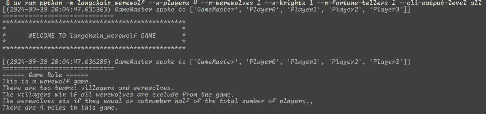
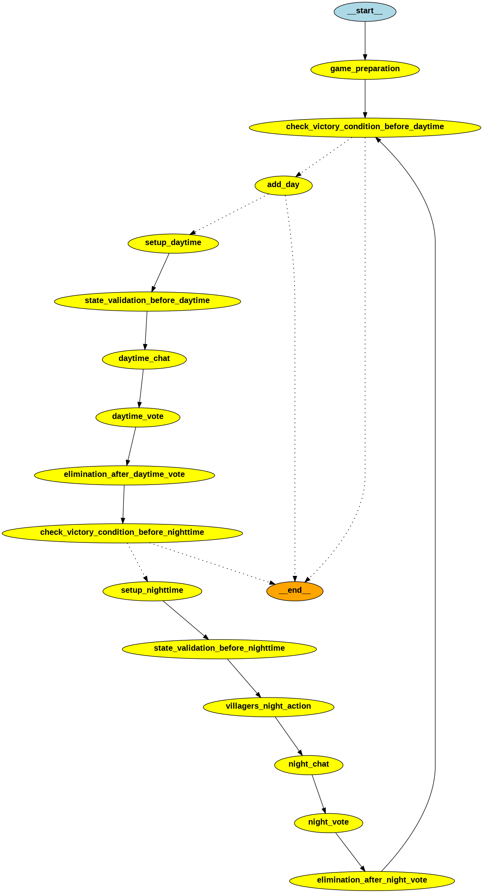

# :chains: :wolf: :chains: `langchain_werewolf` :chains: :wolf: :chains:

A CUI-based simple werewolf game with `langchain` and `langgraph`




## Requirements

- LLM service API keys
  - OpenAI API Key
    - [https://platform.openai.com/api-keys](https://platform.openai.com/api-keys)
  - Groq API Key
    - [https://console.groq.com/keys](https://console.groq.com/keys)
  - Gemini API Key
    - [https://aistudio.google.com/app/apikey](https://aistudio.google.com/app/apikey)

- Python >= 3.10
- Graphviz

## How to Use

### How to Install

```bash
git clone https://github.com/hmasdev/langchain_werewolf.git
cd langchain_werewolf
python -m pip install .
```

If you have `uv`, `uv sync` is also available to install `langchain_werewolf` instead of `python -m pip install .`.

You can also install `langchain_werewolf` directly from the repository.

```bash
python -m pip install git+https://github.com/hmasdev/langchain_werewolf.git
```

### Preparation

1. Create `.env` file
2. Set `OPENAI_API_KEY`, `GROQ_API_KEY` or `GOOGLE_API_KEY` in the `.env` file as follows:

   ```text
   OPENAI_API_KEY=HERE_IS_YOUR_API_KEY
   GROQ_API_KEY=HERE_IS_YOUR_API_KEY
   GOOGLE_API_KEY=HERE_IS_YOUR_API_KEY
   ```

### How to Run

In your command line interface like `bash`,

```bash
python -m langchain_werewolf {HERE_IS_YOUR_FAVORITE_OPTIONS}
```

On the other hand, you can also enjoy `langchain_werewolf` in python environment

```bash
$ python
Python 3.10.11 (main, Sep 20 2024, 18:41:54) [GCC 11.4.0] on linux
Type "help", "copyright", "credits" or "license" for more information.
>>> from langchain_werewolf.main import main
>>> main(**HERE_IS_YOUR_FAVORITE_OPTIONS)
```

## Document

### Available Options

```bash
$ python -m langchain_werewolf --help
Usage: python -m langchain_werewolf [OPTIONS]

Options:
  -n, --n-players INTEGER         The number of players. Default is 4.
  --n-werewolf INTEGER            The number of players with role='werewolf'.
                                  Default is 1.
  --n-villager INTEGER            The number of players with role='villager'.
                                  Default is 0.
  --n-knight INTEGER              The number of players with role='knight'.
                                  Default is 0.
  --n-fortuneteller INTEGER       The number of players with
                                  role='fortuneteller'. Default is 0.
  -o, --output TEXT               The output file. Defaults to "".
  -l, --system-output-level TEXT  The output type of the CLI. ['all',
                                  'public', 'off'] and player names are valid.
                                  Default is All.
  --system-output-interface TEXT  The system interface. Default is
                                  EInputOutputType.standard.
  --system-input-interface TEXT   The system interface. Default is
                                  EInputOutputType.standard.
  --system-formatter TEXT         The system formatter. The format should not
                                  include anything other than "{name}",
                                  "{timestamp}", "{message}",
                                  "{participants}", "{template}".
  -c, --config TEXT               The configuration file. Defaults to "". Note
                                  that you can specify CLI arguments in this
                                  config file but the config file overwrite
                                  the CLI arguments.
  --seed INTEGER                  The random seed. Defaults to -1.
  --model TEXT                    The model to use. Default is gpt-4o-mini.
  --recursion-limit INTEGER       The recursion limit. Default is 1000.
  --debug                         Enable debug mode.
  --verbose                       Enable verbose mode.
  --help                          Show this message and exit.

```

You can also another options in the configuration json file like the followings:


```json
{
    "general": {
        "n_players": 5,
        "n_players_by_role": {
            "werewolf": 2,
            "fortuneteller": 1,
            "knight": 2
        }
    },
    "game": {
        "daytime_chat_kwargs": {
            "n_turns_per_day": 2,
            "select_speaker": "round_robin"
        },
        "nighttime_chat_kwargs": {
            "n_turns_per_day": 2,
            "select_speaker": "random"
        }
    }
}
```


Then, the configuration file can be specified by `-c` or `--config` option.

See [config.py](https://github.com/hmasdev/langchain_werewolf/blob/main/langchain_werewolf/models/config.py) for more details like the schema of the configuration json file.

### Game Structure



You can see a more detailed grpah in [.pics/langchain_werewolf_game_graph.png](./pics/langchain_werewolf_game_graph.png).

<details>

<summary>How to Generate the Drawing of the Graphs</summary>

```python
Python 3.10.11 (main, Sep 20 2024, 18:41:54) [GCC 11.4.0] on linux
Type "help", "copyright", "credits" or "license" for more information.
>>> from dotenv import load_dotenv
>>> load_dotenv()
True
>>> from langchain_werewolf.game.main import create_game_graph
>>> from langchain_werewolf.main import DEFAULT_CONFIG
>>> from langchain_werewolf.setup import generate_players
>>> players = generate_players(DEFAULT_CONFIG.general.n_players, DEFAULT_CONFIG.general.n_werewolves, DEFAULT_CONFIG.general.n_knights, DEFAULT_CONFIG.general.n_fortune_tellers, seed=DEFAULT_CONFIG.general.seed, custom_players=DEFAULT_CONFIG.players)
>>> graph = create_game_graph(players)
>>> graph.get_graph(xray=False).draw_png('pics/langchain_werewolf_game_graph_simple.png')
>>> graph.get_graph(xray=True).draw_png('pics/langchain_werewolf_game_graph.png')
```

</details>

### How to add your custom roles

In `langchain_werewolf`, you can add your custom roles by creating a new class with a decorator.

This section walks you through creating and registering a new role in **langchain_werewolf**.  
Follow the checklist first, then consult the detailed steps and code samples.

#### ✅ Quick Checklist

1. [ ] **Subclass**
   - `BaseGamePlayerRole`
   - One *Side* mixin: `VillagerSideMixin`, `WerewolfSideMixin`, **or** your own subclass of `BasePlayerSideMixin`

2. [ ] **Mandatory class attributes**
   ```python
   role: ClassVar[str] = "YourCustomRole"
   night_action: ClassVar[str] = "YourCustomRole Night Action Description Here"
   ```

   If you want to implement a custom night action, override `act_in_night` method.

3. [ ] **Registration**

   * Add `@PlayerRoleRegistry.register` above your class.
   * Import the module in `langchain_werewolf/game_players/player_roles/__init__.py`

     ```python
     from .your_custom_role import YourCustomRole        # add this line
     ```

#### Step-by-step guide

1. Create a new module in `langchain_werewolf/game_players/player_roles/` directory, e.g. `your_custom_role.py`.
2. Implement your custom role class in the module. The class must inherits from the above 2 classes and have `role` and `night_action` attributes as `ClassVar[str]`. You can implement your own night action method by overriding `act_in_night` method.

   Here are existing role classes in "langchain_werewolf/game_players/player_roles" for example, one is without `act_in_night` and the other is with `act_in_night` method overridden.

   <details> <summary> Villager Implementation </summary>

   ```python
   from typing import ClassVar
    
    from ..base import BaseGamePlayerRole
    from ..player_sides import VillagerSideMixin
    from ..registry import PlayerRoleRegistry
    
    
    @PlayerRoleRegistry.register
    class Villager(BaseGamePlayerRole, VillagerSideMixin):
    
        role: ClassVar[str] = 'villager'
        night_action: ClassVar[str] = 'No night action'
    
   ```

   </details>

   <details> <summary> FortuneTeller Implementation </summary>

   ```python
   import json
    from typing import ClassVar, Iterable
    from pydantic import Field
    from ..base import BaseGamePlayer, BaseGamePlayerRole
    from ..player_sides import VillagerSideMixin
    from ..registry import PlayerRoleRegistry
    from ..utils import is_werewolf_role
    from ...const import GAME_MASTER_NAME
    from ...llm_utils import extract_name
    from ...models.state import (
        MsgModel,
        StateModel,
        create_dict_to_record_chat,
    )
    from ..utils import find_player_by_name
    
    
    @PlayerRoleRegistry.register
    class FortuneTeller(BaseGamePlayerRole, VillagerSideMixin):
    
        role: ClassVar[str] = 'fortuneteller'
        night_action: ClassVar[str] = 'Check whether a player is a werewolf or not'  # noqa
    
        question_to_decide_night_action: str = Field(
            default='Who do you want to check whether he/she is a werewolf or not?',  # noqa
            title="the question to decide the night action of the player",
        )
    
        def act_in_night(
            self,
            players: Iterable[BaseGamePlayer],
            messages: Iterable[MsgModel],
            state: StateModel,
        ) -> dict[str, object]:
            target_player_name_raw = self.generate_message(
                prompt=self.question_to_decide_night_action,
                system_prompt=json.dumps([m.model_dump() for m in messages]),
            )
            target_player_name = extract_name(
                target_player_name_raw.message,
                [p.name for p in players if p.name in state.alive_players_names],  # noqa
                context=f'Extract the valid name of the player as the answer to "{self.question_to_decide_night_action}"',  # noqa
                chat_model=self.runnable,
            )
            try:
                target_player = find_player_by_name(target_player_name, players)
                return create_dict_to_record_chat(  # type: ignore # noqa
                    self.name,
                    [GAME_MASTER_NAME],
                    f'{target_player.name} is a werewolf'
                    if is_werewolf_role(target_player)
                    else f'{target_player.name} is not a werewolf'
                )
            except ValueError:
                return create_dict_to_record_chat(  # type: ignore # noqa
                    self.name,
                    [GAME_MASTER_NAME],
                    f'Failed to find the target player: {target_player_name}'
                )
    
   ```

   </details>

3. Finally, add the module name into `langchain_werewolf/game_players/player_roles/__init__.py` file.

   ```python
   from .fortune_teller import FortuneTeller
   from .knight import Knight
   from .villager import Villager
   from .werewolf import Werewolf
   from .your_custom_role import YourCustomRole

   __all__ = [
      FortuneTeller.__name__,
      Knight.__name__,
      Villager.__name__,
      Werewolf.__name__,
   ]
   ```

4. Test your custom role applied to the game by check the CLI help message.

   ```bash
   python -m langchain_werewolf --help
   ```

## Examples

TBD

## Contribution

### How to Develop

1. Fork the repository: [https://github.com/hmasdev/langchain_werewolf](https://github.com/hmasdev/langchain_werewolf)

2. Clone the repository

   ```bash
   git clone https://github.com/{YOURE_NAME}/langchain_werewolf
   cd langchain_werewolf
   ```

3. Create a virtual environment and install the required packages

   ```bash
   python -m venv venv
   source venv/bin/activate
   python -m pip install -e .[dev]
   ```

   or

   ```bash
   uv sync --extra dev
   ```

   if you uses `uv`.

4. Checkout your working branch

   ```bash
   git checkout -b your-working-branch
   ```

5. Make your changes

6. Test your changes

   ```bash
   pytest
   flake8 langchain_werewolf tests
   mypy langchain_werewolf tests
   ```

   or

   ```bash
   uv run pytest
   uv run flake8 langchain_werewolf tests
   uv run mypy langchain_werewolf tests
   ```

   Note that the above commands run only unit tests.
   It is recommended to run integration tests with `uv run pytest -m integration`.

7. Commit your changes

   ```bash
   git add .
   git commit -m "Your commit message"
   ```

8. Push your changes

   ```bash
   git push origin your-working-branch
   ```

9. Create a pull request: [https://github.com/hmasdev/langchain_werewolf/compare](https://github.com/hmasdev/langchain_werewolf/compare)

## LICENSE

[MIT](https://github.com/hmasdev/langchain_werewolf/tree/main/LICENSE)

## Authors

- [hmasdev](https://github.com/hmasdev)
